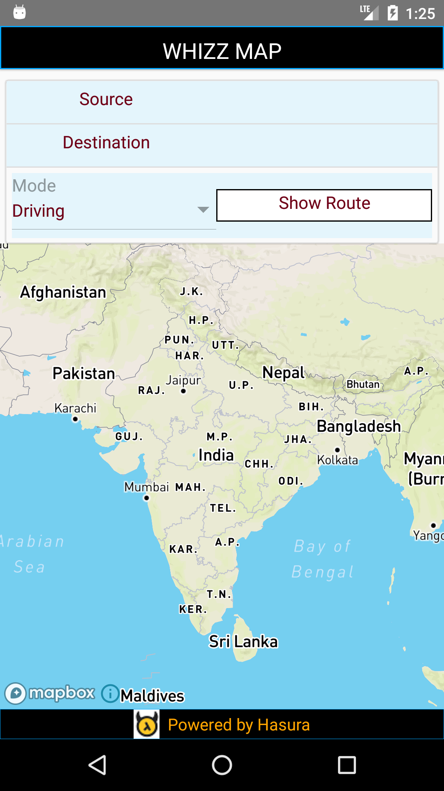

# images_demo
images_demo

WhizzMap is a simple Mapbox based app that was developed as part of Hasura Product Development Fellowship – Version 2 (HPDFv2) by Team 51. It consists of 
    • a React JS based Web app
    • a ReactNative based mobile app 
    • a Python Flask back-end API
    
Contributors:
    • React JS – Web app : 		<link to Github profile>
    • React Native – Mobile App :	<link to Github profile>
    • Backend – Python -Flask :	<link to Github profile>
    
About the App :
    • A simple Map that allows users to enter the source, destination and the mode of transportation ( Driving / Cycling / Walking )
    • Shows the shortest route to the destination from the source/starting point
    • Displays the Time taken for travel 
    • Shows the total Distance between the two places
    • User can also view the Turn by Turn Instructions to travel from source to destination

Mobile version of the App (React Native) :
    • This app is the Mobile version of the WhizzMap and created with React Native  using native code (react-native init) 
    • Integrates with Mapbox Maps SDK for React Native  (react-native-mapbox-gl). 
    • A Python-flask server is also bundled with this app and  handles the app’s requests for API endpoints
    • Source code for the react-native app is in the react-native folder of the git repo
    • The Google Drive link to the .apk file is  - https://drive.google.com/open?id=1NjZdkVLHAhH9K7RKXCO0xpHFsJ1_UqLQ
      
Pre-requisites
    • We need Node.js and npm (Package Manager for Javascript) to start with. Ensure that you have Node installed on your computer, do this by running node-v in the terminal. If you do not have Node installed you can get it from https://nodejs.org
    • Check whether  you have the latest version of the hasura cli installed. You can find instructions to download the  hasura cli from here
    • In this project, we are using Mapbox SDK and to access their APIs you need a Mapbox Access Token . Find instructions to get one here.
      
How to get it running?

If you are planning to test the app and also need a backend server without setting it up locally, continue with the instructions in the ‘Quick-start’ section.
A detailed step by step instructions to setup the whole environment needed to edit and run the app locally can be found in the ‘Making changes and testing it  Locally’ section.

Quick-start :
      To know more about the look and feel of the app, install the .apk file in the emulator/device of your choosing. Instructions for the same follows,
    • This App requires Android 6.0 (Marshmallow) SDK in particular.
    • Setup the Android Emulator / Android Physical Device as per the instructions given here.
    • Download the .apk file from the location mentioned 
    • Install the .apk file in the Emulator / Physical device.
    • To run the app, it needs a Backend server, that accepts the API endpoint requests. For this project, the python-flask server is deployed in the Hasura cluster filling69.
    • Open the url https://app.filling69.hasura-app.io/ in the browser to Start the server microservice.
    • Run the app in the Emulator/ Device.
    • P.S If the mentioned cluster is not available / working , you can test the app by following the instructions under ‘Making Changes and testing it Locally’ section.
Making changes and testing it  Locally:
The React Native app was created using Native code method (react-native init <ProjectName>). To test and make changes to this app locally, follow the below instructions. This react native project is a part of the WhizzMap
    • Dependencies: 
        ◦ Node
        ◦ Python 2
        ◦ JDK (for building the .apk file)
        ◦ React Native CLI (Command  Line Interface)
        ◦ Android Studio 
        ◦ Android Virtual Device / Physical Device
        ◦ Visual Studio Code (or any Editor of your choice)
        ◦ Mapbox Access Token (optional)
    • Instructions to install the dependencies are given here ( link ) 
    • Choose the Development OS-  Windows  & Target OS - Android, the corresponding details will be displayed on the page. As of now, this WhizzMap Mobile app runs on Android only
    • Open the GitBash.
    • Setup the server in Hasura cluster -- Getting the Hasura project
  $ hasura quickstart ‘username/WhizzMap-T51’
		$ cd <projectname>
		# Deploy
		$ git add . && git commit -m "Deployment commit"
		$ git push hasura master

		After the git push completes:
		$ hasura microservice list

        ◦ The hasura quickstart command clones the project repository to your local computer, and also creates a free Hasura cluster, where the project will be hosted for free.
        ◦ A git remote (called hasura) is created and initialized with your project directory.	
        ◦ Get the name of your cluster by running the command hasura cluster status
        ◦ Open the flask app url in browser https://app.<cluster name>.hasura-app.io/ so that python flask microservice is started. If you get a message stating that the cluster is waking, wait for a minute or two and try accessing it again. Once the page is displayed properly, everything is working as expected - the microservice is started and ready to accept your API endpoint requests.
    • Setup the server locally
        ◦ Press the Clone or download  button in the git repositry, to download the repo to your system
        ◦ Start the flask server so that it could listen and respond to local requests
    • Change the directory to the react-native folder of the WhizzMap Project 
    • Run the command npm install to install the dependencies listed in the package.json file
    • Changes to utils.js file
        ◦ Modify the file react-native/utils.js by changing the  value of the constant clusterName  to that of your cluster name. This needs to be done, only when the app is sending requests to the server running in the cluster.
        ◦ If the app is sending requests to local server, change the url of the request accordinly in the React Native app.
        ◦ Optionally, if you want to use your Mapbox Access Token, change the value of the constant mapboxAccessToken to your token value
    • Launch the Android Virtual Device (AVD) in the Emulator .If you are using Physical Device, connect it the PC.
    • Change the directory to the react-native folder. Run the command, react-native run-android
    • To change or modify the app, start editing from index.js file ( the entry point of React Native applications)  in the react-native folder
Managing app dependencies:
    • npm/yarn dependencies  can be managed by editing package.json.
    • Changes to the server can be done by editing – in (cluster..and push)
    • If you have an existing Backend server, u can replace the file ‘’ with your pre-existing server and modify the React Native code accordingly.
Migrating your existing ReactNative app:
    • Replace react-native directory with your pre-existing react-native project directory.
    • Run npm install from this new directory
    • Make changes in your backend if needed.
    • App is ready
Steps to build an .apk file (React Native app) :
Generating .apk file for app created by command react-native init on Windows.
    • In the command prompt , cd to your React Native project, here it is react-native.
    • Run the command, 
    • react-native bundle --platform android --dev false --entry-file index.js --bundle-output android/app/src/main/assets/index.android.bundle --assets-dest android/app/src/main/res/ 
    • Open the android folder of the  React Native app in Android Studio and follow the instructions to create a certificate to sign the apk

    • Open Build-> Generate Signed APK... in the Android Studio Toolbar and follow the instructions.
    
        • Fill all the information on ‘New Key Store’ dialog box. Click ‘OK’. Click ‘Next’. Click ‘Finish’
    • Generated .apk file will be stored in the chosen path.
Working of the App:
Initially after the first render, the screen displayed on the device has the following components,
    • The screen has 2 TextInput components to enter the Source & Destination
    • The mode of Transportation can be selected from the  Dropdown (Mode) component (Driving /Cycling / Walking)
    • A Button component (Show Route) 
    • A Mapbox MapView Component which displays the map.
    
