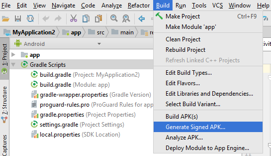
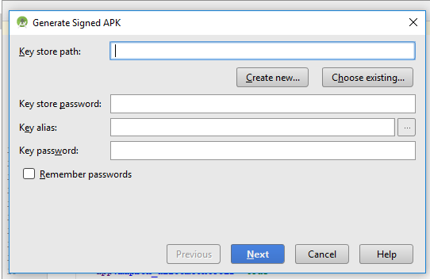
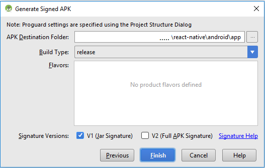

# WhizzMap

WhizzMap is a simple Mapbox based app that was developed as part of Hasura Product Development Fellowship – Version 2 (*HPDFv2*) by Team 51. It consists of 
- a React JS based Web app
- a ReactNative based mobile app
- a Python Flask back-end API

## Contributors:

- React JS – Web app : [Sathya](https://github.com/sathya9897)
- React Native – Mobile App : [Padma](https://github.com/padmasaravan) 
- Backend – Python -Flask : [Vinitha](https://github.com/vinitha-shree0)

## About the App :

- A simple Map app with a [Hasura](https://hasura.io) backend. You can clone it and modify as per your requirements. It has basic *BaaS* features implemented.
- Allows users to enter the source, destination and the mode of transportation ( Driving / Cycling / Walking )
- Shows the shortest route to the destination from the source/starting point
- Displays the Time taken for travel & the total Distance between the two places
- User can also view the Turn by Turn Instructions to travel from source to destination

## Mobile version of the App (React Native) :

- This app is the Mobile version of the WhizzMap and created with React Native  using native code (```react-native init```)
- Integrates with **Mapbox Maps SDK for React Native  (```react-native-mapbox-gl```)**. 
- A **Python-flask** server is also bundled with this app and  handles the app’s requests for API endpoints
- Source code for the react-native app is in the **```react-native```** folder of the git repo
- The Google Drive link to the **.apk** file is  - **https://drive.google.com/open?id=1NjZdkVLHAhH9K7RKXCO0xpHFsJ1_UqLQ**

## Pre-requisites

- We need **Node.js** and ```npm``` (Package Manager for Javascript) to start with. Ensure that you have Node installed on your computer, do this by running ```node -v``` in the terminal. If you do not have Node installed you can get it from https://nodejs.org
- Check whether  you have the latest version of the ```hasura cli``` installed. You can find instructions to download the  ```hasura cli``` from here
- In this project, we are using **Mapbox SDK** and to access their APIs you need a **Mapbox Access Token** . Find instructions to get one [here](https://www.mapbox.com/help/how-access-tokens-work/).

## How to get it running?

If you are planning to test the app and also need a backend server without setting it up locally, continue with the instructions in the **Quick-start** section.
A detailed step by step instructions to setup the whole environment needed to edit and run the app locally can be found in the **Making changes and testing it  Locally** section.

## Quick-start :

To know more about the look and feel of the app, install the ```.apk``` file in the emulator/device of your choosing. Instructions for the same follows,

- This App requires **Android 6.0 (Marshmallow) SDK** in particular.
- Setup the Android Emulator / Android Physical Device as per the instructions given [here](https://facebook.github.io/react-native/docs/getting-started.html#preparing-the-android-device).
- Download the ```.apk``` file from the location mentioned 
- Install the ```.apk``` file in the Emulator / Physical device.
- To run the app, it needs a Backend server, that accepts the API endpoint requests. For this project, the python-flask server is deployed in the Hasura cluster ```filling69```.
- Open the url https://app.filling69.hasura-app.io/ in the browser to Start the server microservice.
- Run the app in the Emulator/ Device.

```:bash
  P.S : If the mentioned cluster is not available / working , you can test the app by following the instructions under ‘Making Changes and testing it Locally’ section.
```
## Making changes and testing it  Locally:

The React Native app was created using **Native code** method (```react-native init <ProjectName>```). To test and make changes to this app locally, follow the below instructions. This react native project is a part of the WhizzMap

- Dependencies: 
  - Node
  - Python 2
  - JDK (for building the .apk file)
  - React Native CLI (Command  Line Interface)
  - Android Studio 
  - Android Virtual Device / Physical Device
  - Visual Studio Code (or any Editor of your choice)
  - Mapbox Access Token
        
- Instructions to install the dependencies are given [here](https://facebook.github.io/react-native/docs/getting-started.html#installing-dependencies) 
- Choose the Development OS-  Windows  & Target OS - Android, the corresponding details will be displayed on the page. As of now, this WhizzMap Mobile app runs on Android only
- Open the GitBash.

##### Setup the server in Hasura cluster -- Getting the Hasura project
```bash
    $ hasura quickstart sathya/whizzmap
	$ cd whizzmap
	# Deploy
	$ git add . && git commit -m "Deployment commit"
	$ git push hasura master
```
After the git push completes:
```bash
    $ hasura microservice list
```
- The ```hasura quickstart``` command clones the project repository to your local computer, and also creates a free Hasura cluster,   where the project will be hosted for free.
- A git remote (called ```hasura```) is created and initialized with your project directory.	
- Get the name of your cluster by running the command ```hasura cluster status```
- Open the flask app url in browser https://app.<cluster name>.hasura-app.io/ so that python flask microservice is started. If you get a message stating that the cluster is waking, wait for a minute or two and try accessing it again. Once the page is displayed properly, everything is working as expected - the microservice is started and ready to accept your API endpoint requests.

##### Setup the server locally

- Press the **Clone or download**  button in the git repositry, to download the repo to your local directory
- Start the flask server, so that it could listen and respond to local requests

- Change the directory to the ```react-native``` folder of the WhizzMap Project 
- Run the command ```npm instal```l to install the dependencies listed in the ```package.json``` file

##### Changes to utils.js file

- Modify the file ```react-native/utils.js``` by changing the  value of the constant ```clusterName```  to that of your cluster name. This needs to be done, only when the app is sending requests to the server running in the cluster.
- If the app is sending requests to local server, change the url of the request accordingly in the source code.
- Optionally, if you want to use your own Mapbox Access Token, change the value of the constant ```mapboxAccessToken``` to your token value

#####
- Launch the Android Virtual Device (AVD) in the Emulator .If you are using Physical Device, connect it the PC.
- Change the directory to the ```react-native``` folder. Run the command, ```react-native run-android```
- To change or modify the app, start editing from ```index.js``` file ( the entry point of React Native applications)  in the ```react-native``` folder
    
## Managing app dependencies:

- ```npm/yarn``` dependencies  can be managed by editing ```package.json```.
- Changes to the server can be done by editing the source code in ```microservices/app``` 
- If you have an existing Backend server, u can replace it with existing server and modify the React Native code accordingly.

## Migrating your existing ReactNative app:

- Replace ```react-native``` directory with your pre-existing react-native project directory.
- Run ```npm install``` from this new directory
- Make changes in your backend if needed.
- App is ready

## Steps to build an .apk file (React Native app) :

Generating **```.apk```** file for App created  through **```react-native init```** on Windows.

- In the command prompt , **```cd```** to your React Native project, here it is **```react-native```**
- Create the dir **assets** if not already there in the path **\android\app\src\main\assets**
- Run the command, 
```bash
react-native bundle --platform android --dev false --entry-file index.js --bundle-output android/app/src/main/assets/index.android.bundle --assets-dest android/app/src/main/res/
```
- Open the **```android```** folder of the  React Native app in **Android Studio** and follow the instructions to create a certificate to sign the apk
- Open **Build-> Generate Signed APK...** in the Android Studio Toolbar and follow the instructions


- In the **Generate Signed APK** Dialog box,  click **Create new** button.
	
- Fill all the information on ‘New Key Store’ dialog box. Click ‘OK’. Click ‘Next’. Click ‘Finish’
-  In the next Dialog box , chose the destination folder for the APK file
- Chose Build Type as – **release**
- Signature Versions : **V1** . 
- V2 is for Android 7.0 and above.
- Generated .apk file will be generated and stored in the chosen path **(android\app\release)**


## Working of the App:
Initially after the first render, the screen displayed on the device has the following components,
- The screen has 2 TextInput components to enter the Source & Destination
- The mode of Transportation can be selected from the  Dropdown (Mode) component (Driving /Cycling / Walking)
- A Button component (Show Route) 
- A Mapbox MapView Component which displays the map.


Once the source, destination and  Mode of transportation details are entered by the user, the request to API endpoint /directions is sent by the app.

This is triggered by two events, 
1. User presses the Show Route Button
2. User changes the Mode (Driving /Cycling / Walking)

The response from the server is processed, if no routes are found, an alert box is displayed.

```javascript
	const resData = resBackEnd.data;
	const resDirc = resData.routes[0]; // directions
	if (!resDirc){
			Alert.alert('No Route Error','No route found for the given inputs !!!');
           		return;
	}
```
On successful processing of the response, the Coordinates of the Source & Destination , the time taken for travel  (in secs) , Distance to be traveled  (in metres )and Turn by Turn instructions are extracted and displayed on screen.

```javascript
			srcCoord= resData.origin.geometry.coordinates; 
         	destCoord= resData.destination.geometry.coordinates; 
         	const resDist= resData.routes[0].distance; 
        	 const resDurn= resData.routes[0].duration;
         	const resSteps= resData.routes[0].steps; // instructions
         
        	 //Instructions to travel from source to destination
 
         	let instructions = [];
         	resSteps.forEach(step => {
            	 	instructions.push(step.maneuver.instruction);
        	 });
```
- The Source and Destination are added to the map as ```Point Annotation```
- The route between the places is displayed on the map using ```ShapeSource``` component.


- At the bottom of the screen, the below mentioned details are displayed,
  1. Time taken to travel from source to destination in Days / Hrs / Mins
  2. Distance in kms
  3. A  ```Touchable Opacity Component``` (Show Directions) , which when pressed opens a ```ActionSheet``` displaying the Turn by Turn instructions to travel from source to Destination.
  


## How to include a database?

- Hasura provides instant data APIs over Postgres to make powerful data queries. For example, to select "id" and "title" of all rows from the article table, make this query to `https://data.<cluster-name>.hasura-app.io/v1/query/`

```:json
{
    "type":"select",
    "args":{
        "table":"article",
        "columns":[
            "title",
            "id"
        ],
        "where":{
            "author_id":4
        }
    }
}
```

- This app uses the above query and renders the list of articles as shown below.


- You can also exploit relationships. In the pre-populated schema, the author table has a relationship to the article table. The app uses the following query to render the article page.
```:json
{
    "type":"select",
    "args":{
        "table":"article",
        "columns":[
            "title",
            "content"
            "id",
            {
                "name": "author",
                "columns":[
                    "name",
                    "id"
                ]
            }
        ],
        "where":{
            "author_id":4
        }
    }
}
```


- The Hasura API Console is a UI which makes managing the backend easier. To access your api-console, run

```
$ hasura api-console
```

- You can build queries easily using the query builder on API-Console.


- Also, there are ready made code snippets generated for the query that you build with the query builder. You can instantly copy and paste them in your code.


## How to add authentication?

- Every app almost always requires some form of authentication. Hasura gives you a flexibility to implement almost every popular login mechanism (mobile, email, facebook, google etc) in your app.
- In this application, we are using just the normal username password login. You can implement whichever login you need. The auth screen looks like this.


- You can try out all the auth APIs in the API console. Check out.

```
$ hasura api-console
```

## How to migrate from an existing project?

- Replace react-native directory with your pre-existing react-native project directory.
- run `npm install` from this new directory
- Make changes in your backend with API-Console
- App is ready

## How to use a custom API/server?

- Sometimes you might need to add new microservices/APIs as per your requirements. In such cases, you can deploy your microservices with Hasura using git push or docker.
- This quickstart comes with one such custom microservice written in nodejs using the express framework. Check it out in action at `https://api.<cluster-name>.hasura-app.io`. Currently, it just returns a "Hello-React" at that endpoint.
- This microservice is in the microservices folder of the project directory. You can add your custom microservice there.
- To generate your own custom microservice, run

```
$ hasura microservice generate --help
```
>>>>>>> d64c0e9511ec61c3b65908c333c7a9bed2c2429d
